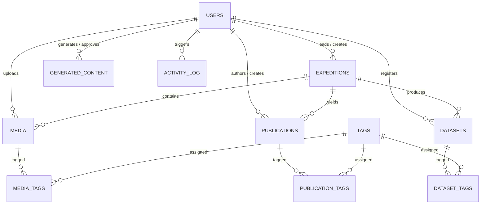

<div align="center">

# 🧊 Polar Science Outreach Portal
### *Unified Digital Ecosystem for Polar Research, Knowledge Dissemination & AI Science Outreach*

[](https://www.sih.gov.in/)
[](https://ncpor.res.in/)
[](https://ncpor.res.in/)
[](https://nodejs.org)
[](https://expressjs.com)
[](https://supabase.com)
[](https://polar-outreach.onrender.com/api/v1/health)
[](https://polar-outreach.onrender.com/api-docs)

<p align="center">
  <b>Developed for National Centre for Polar and Ocean Research (NCPOR)</b><br/>
  <i>Ministry of Earth Sciences, Government of India</i>
</p>

</div>

---

## 📌 Table of Contents

- [Executive Summary](#-executive-summary)
- [The Problem vs Our Solution](#-the-problem-vs-our-solution)
- [Key Features & Capabilities](#-key-features--capabilities)
- [System Architecture](#-system-architecture)
- [Tech Stack](#-tech-stack)
- [AI Science Communicator (Groq LPU)](#-ai-science-communicator-groq-lpu)
- [API Documentation & Interactive Swagger](#-api-documentation--interactive-swagger)
- [Database & Storage Design](#-database--storage-design)
- [Quick Start Guide](#-quick-start-guide)
- [API Reference](#-api-reference)
- [Project Directory Structure](#-project-directory-structure)
- [Team & Acknowledgments](#-team--acknowledgments)

---

## 📖 Executive Summary

India's presence at the Earth's extremes spans over four decades: from **Maitri** (1989) and **Bharati** (2012) in Antarctica to **Himadri** (2008) in the Arctic and **Himansh** (2016) in the Himalayas. These missions generate petabytes of climate records, glaciological surveys, biological discoveries, and high-resolution media.

The **Polar Science Outreach Portal (SIH26063)** is an enterprise-grade, high-performance digital portal and API engine designed to catalog, preserve, visualize, and communicate India’s polar achievements to scientists, students, policymakers, and the public.

---

## 🎯 The Problem vs Our Solution

```
┌─────────────────────────────────────────────────────────┐
│                    THE CHALLENGE                        │
│  • Fragmented data silos across disparate servers       │
│  • Technical papers too dense for public comprehension  │
│  • Lack of geospatial context for scientific assets     │
│  • Manual social media outreach is slow & labor-heavy   │
└────────────────────────────┬────────────────────────────┘
                             │
                             ▼
┌─────────────────────────────────────────────────────────┐
│                     OUR SOLUTION                        │
│  ✔ Unified Digital Repository (Expeditions, Datasets)   │
│  ✔ Interactive Polar Stations & Geo-Tagged Media Map    │
│  ✔ Groq-Powered AI Multi-Platform Science Communicator   │
│  ✔ Role-Governed Editorial Approval & Scheduling Engine │
│  ✔ Sub-50ms Full-Text Federated Search & Analytics      │
└─────────────────────────────────────────────────────────┘
```

---

## 🌟 Key Features & Capabilities

### 1. 🗺️ Interactive Polar Geospatial Mapping
- Real-time station mapping across **Antarctica (Bharati, Maitri)**, **Arctic (Ny-Ålesund / Himadri)**, and **Himalayas (Chandra Basin / Himansh)**.
- Geo-tagged multimedia pins showing field photography, video surveys, and atmospheric observatory locations.

### 2. 🤖 AI-Powered Multi-Platform Science Communicator
- Converts complex research abstracts and dataset metadata into tailored social media content.
- Platform-optimized output for **Twitter/X ($\le 280$ chars)**, **Instagram**, **LinkedIn**, **Facebook**, and **Website Articles**.
- Human-in-the-loop governance: AI creates `DRAFT` $\rightarrow$ Researcher refines $\rightarrow$ Admin approves/publishes.

### 3. 🔍 Federated Full-Text Search
- Instant search across Expeditions, Publications, Media, and Datasets with type filtering and autocomplete suggestions.
- Powered by PostgreSQL full-text indexing with in-memory TTL caching.

### 4. 📊 Open Data Repository & Download Tracker
- Secure hosting of scientific formats (`CSV`, `NETCDF`, `JSON`, `XLSX`, `PDF`) on Supabase S3-compatible storage.
- Automated download counting and citation tracking for researchers.

### 5. 📸 Automated Media Processing Pipeline
- High-performance thumbnail generation for field photography via **Sharp** (WebP 300x300).
- Automatic cleanup of storage assets upon record deletion.

### 6. 📈 Executive Analytics & Audit Trail
- High-level KPIs, 5-year publication trends, download statistics, and timeline views.
- Complete administrative audit trail of all platform activities.

---

## 🏛️ System Architecture

```
                    ┌─────────────────────────┐
                    │  Frontend Web & Mobile  │
                    │  (Next.js / React / UI) │
                    └────────────┬────────────┘
                                 │ HTTP / JSON / Multipart
                                 ▼
┌────────────────────────────────────────────────────────────────────────┐
│                        EXPRESS.JS BACKEND ENGINE                       │
│                                                                        │
│  ┌─────────────────┬───────────────────┬────────────────────────────┐  │
│  │ CORS & Helmet   │ Morgan Logger     │ Zod Request Validators     │  │
│  ├─────────────────┼───────────────────┼────────────────────────────┤  │
│  │ Supabase Auth   │ Multer Streamer   │ Global Error Interceptor   │  │
│  └─────────────────┴───────────────────┴────────────────────────────┘  │
│                                                                        │
│  MODULE ROUTERS:                                                       │
│  ├── /health          ├── /publications   ├── /map                     │
│  ├── /expeditions     ├── /datasets       ├── /outreach (AI)           │
│  ├── /media           ├── /search         ├── /analytics               │
└────────────────────┬───────────────────────────────────┬───────────────┘
                     │                                   │
                     ▼                                   ▼
        ┌─────────────────────────┐         ┌─────────────────────────┐
        │     SUPABASE CLOUD      │         │     GROQ AI ENGINE      │
        │  • PostgreSQL Database  │         │  • LPU Inference        │
        │  • Row-Level Security   │         │  • Qwen 2.5 / Llama 3.3 │
        │  • 3 Storage Buckets    │         │  • Multi-Platform Posts │
        │  • JWT Authentication   │         │  • <500ms Response      │
        └─────────────────────────┘         └─────────────────────────┘
```

---

## 💻 Tech Stack

| Domain | Technology | Description |
|---|---|---|
| **Runtime** | `Node.js 18+` | Server-side JavaScript execution engine |
| **Framework** | `Express.js 4.x` | RESTful API routing, middleware, and request handling |
| **Database** | `PostgreSQL 15 (Supabase)` | Relational data store with JSONB, triggers, and full-text indexes |
| **Authentication** | `Supabase Auth (JWT)` | Role-Based Access Control (`ADMIN`, `RESEARCHER`, `PUBLIC`) |
| **Storage Buckets** | `Supabase Storage` | S3-compatible cloud buckets (`polar-media`, `polar-publications`, `polar-datasets`) |
| **AI Inference** | `Groq LPU SDK` | Ultra-fast LLM inference (`qwen/qwen3.8-27b` / `llama-3.3-70b-versatile`) |
| **Validation** | `Zod 3.x` | Strict type-safe schema parsing and input validation |
| **Media Processing** | `Sharp` | High-speed image transcoding & automated WebP thumbnailing |
| **File Uploads** | `Multer` | In-memory multipart buffer processing |
| **Documentation** | `Swagger / OpenAPI 3.0` | Live interactive UI at `/api-docs` |
| **Utilities** | `Cors`, `Helmet`, `Morgan`, `Dotenv` | Security headers, request logging, and environment configuration |

---

## 🤖 AI Science Communicator (Groq LPU)

The portal incorporates an **Automated Science Communication Pipeline**:

```
[Technical Research Paper / Expedition / Dataset]
                       │
                       ▼
    [System Persona: NCPOR Science Communicator]
                       │
       ┌───────────────┼───────────────┬───────────────┐
       ▼               ▼               ▼               ▼
  [Twitter/X]     [Instagram]     [LinkedIn]       [Website]
  • ≤ 280 chars   • Visual tone   • Policy focus   • SEO Summary
  • Hashtags      • Atmospheric   • Monsoon link   • 300-500 words
```

### Supported AI Modes
1. **`groq` *(Active)*:** Sub-second inference via Groq LPU engine.
2. **`mock` *(Demo-Safe)*:** Realistic NCPOR pre-built templates requiring zero API keys.
3. **`openai`:** Compatible with `gpt-4o-mini` if preferred.
4. **`ollama`:** Local on-premise LLM hosting for air-gapped government setups.

---

## 📑 API Documentation & Interactive Swagger

The API comes with built-in **Swagger UI** for testing all endpoints directly in your browser.

- **Live Production Swagger UI:** [`https://polar-outreach.onrender.com/api-docs`](https://polar-outreach.onrender.com/api-docs)
- **Local Development Swagger UI:** [`http://localhost:3000/api-docs`](http://localhost:3000/api-docs)

---

## 🗄️ Database & Storage Design

The PostgreSQL database contains **11 normalized tables** with referential integrity:



### Storage Buckets Setup:
- `polar-media`: High-res photos, expedition videos, field audio, and generated thumbnails.
- `polar-publications`: Peer-reviewed research papers and expedition reports (PDF).
- `polar-datasets`: Raw scientific data files (`.csv`, `.nc`, `.json`, `.xlsx`).

---

## 🚀 Quick Start Guide

### 1. Prerequisites
- **Node.js** 18.0.0 or higher
- **npm** 9.0.0 or higher
- A free **Supabase** account ([supabase.com](https://supabase.com))
- A free **Groq** API Key ([console.groq.com](https://console.groq.com)) *(optional, mock mode works without keys)*

### 2. Installation
```bash
# Clone the repository
git clone https://github.com/amit-dev01/SIH.git
cd SIH/polar-backend

# Install dependencies
npm install
```

### 3. Environment Configuration
Create a `.env` file in the `polar-backend` directory:
```env
# Supabase Configuration
SUPABASE_URL=https://your-project.supabase.co
SUPABASE_ANON_KEY=your_supabase_anon_key
SUPABASE_SERVICE_ROLE_KEY=your_supabase_service_role_key

# Server Configuration
PORT=3000
NODE_ENV=development

# AI Configuration
AI_PROVIDER=groq
GROQ_API_KEY=gsk_your_groq_api_key_here
GROQ_MODEL=qwen/qwen3.8-27b
```

### 4. Database Setup & Seed Data
1. Open your **Supabase Dashboard** $\rightarrow$ **SQL Editor**.
2. Run [`polar-backend/database/setup.sql`](polar-backend/database/setup.sql) to initialize tables and indexes.
3. *(Optional)* Run [`polar-backend/database/seed.sql`](polar-backend/database/seed.sql) to insert sample NCPOR expeditions, publications, and datasets.
4. Under **Storage**, create 3 public buckets: `polar-media`, `polar-publications`, `polar-datasets`.

### 5. Launch the Server
```bash
# Development mode (auto-reload on save)
npm run dev

# Production mode
npm start
```

### 6. Verify Installation
- **Live Production Health Check:** `curl https://polar-outreach.onrender.com/api/v1/health`
- **Live Swagger Documentation:** [https://polar-outreach.onrender.com/api-docs](https://polar-outreach.onrender.com/api-docs)
- **Local Health Check:** `curl http://localhost:3000/api/v1/health`
- **Local Swagger UI:** [http://localhost:3000/api-docs](http://localhost:3000/api-docs)

---

## 📡 API Reference

### 🌐 Public Endpoints (No Auth Required)
| Method | Endpoint | Description |
|---|---|---|
| `GET` | `/api/v1/health` | Server status and Supabase DB connection check |
| `GET` | `/api/v1/expeditions` | List all expeditions with filters (`region`, `status`, `year`, `search`) |
| `GET` | `/api/v1/expeditions/:id` | Detailed expedition profile by UUID or slug |
| `GET` | `/api/v1/expeditions/:id/stats` | Aggregated counts of papers, media, and datasets for an expedition |
| `GET` | `/api/v1/media` | Browse photo, video, audio, and document assets |
| `GET` | `/api/v1/media/:id` | Fetch single media details with storage URLs |
| `GET` | `/api/v1/publications` | Search scientific publications with author/year filters |
| `GET` | `/api/v1/publications/stats` | 5-year publication metrics and distribution by region |
| `GET` | `/api/v1/publications/:id` | Publication abstract and download link |
| `GET` | `/api/v1/datasets` | List open-access scientific datasets |
| `GET` | `/api/v1/datasets/:id` | Dataset metadata and license information |
| `GET` | `/api/v1/datasets/:id/download`| Increments download counter & returns public download URL |
| `GET` | `/api/v1/search?q=` | Federated full-text search across all portal content |
| `GET` | `/api/v1/search/suggest?q=` | Live autocomplete search suggestions |
| `GET` | `/api/v1/map/locations` | Geo-coordinates of base stations & tagged media pins |
| `GET` | `/api/v1/map/expeditions` | Expedition station coordinates |
| `GET` | `/api/v1/map/media` | Geo-tagged photo and video locations |
| `GET` | `/api/v1/outreach/published` | Public feed of approved polar outreach stories |
| `GET` | `/api/v1/analytics/popular` | Most downloaded datasets, latest media, and top expeditions |
| `GET` | `/api/v1/analytics/timeline` | Expedition commencement and completion timeline |

### 🔒 Protected Endpoints (Bearer JWT Required)
| Method | Endpoint | Required Role | Description |
|---|---|---|---|
| `POST` | `/api/v1/expeditions` | `ADMIN`, `RESEARCHER` | Register new polar expedition |
| `PUT` | `/api/v1/expeditions/:id` | `ADMIN`, `RESEARCHER` | Update expedition details |
| `DELETE`| `/api/v1/expeditions/:id` | `ADMIN` | Remove expedition |
| `POST` | `/api/v1/media/upload` | `ADMIN`, `RESEARCHER` | Upload single media file (auto WebP thumbnail) |
| `POST` | `/api/v1/media/bulk-upload` | `ADMIN`, `RESEARCHER`| Batch upload up to 20 media files |
| `DELETE`| `/api/v1/media/:id` | `ADMIN`, `RESEARCHER` | Delete media asset and remove from cloud storage |
| `POST` | `/api/v1/publications` | `ADMIN`, `RESEARCHER` | Upload research paper with optional PDF |
| `PUT` | `/api/v1/publications/:id` | `ADMIN`, `RESEARCHER`| Edit publication record |
| `DELETE`| `/api/v1/publications/:id`| `ADMIN` | Delete publication and attached PDF |
| `POST` | `/api/v1/datasets` | `ADMIN`, `RESEARCHER` | Upload scientific dataset file (`CSV`, `NETCDF`, etc.) |
| `PUT` | `/api/v1/datasets/:id` | `ADMIN`, `RESEARCHER` | Edit dataset metadata |
| `DELETE`| `/api/v1/datasets/:id` | `ADMIN` | Delete dataset and file from storage |
| `POST` | `/api/v1/outreach/generate` | `ADMIN`, `RESEARCHER`| Generate AI social posts via Groq |
| `GET` | `/api/v1/outreach/drafts` | `ADMIN`, `RESEARCHER` | View pending outreach drafts |
| `PUT` | `/api/v1/outreach/:id` | `ADMIN`, `RESEARCHER` | Edit draft text / attach media URLs |
| `PUT` | `/api/v1/outreach/:id/approve` | `ADMIN` | Approve outreach post for publication |
| `PUT` | `/api/v1/outreach/:id/reject` | `ADMIN` | Reject outreach draft |
| `PUT` | `/api/v1/outreach/:id/publish` | `ADMIN` | Publish outreach post to public portal feed |
| `PUT` | `/api/v1/outreach/:id/schedule`| `ADMIN` | Schedule outreach post for future date |
| `GET` | `/api/v1/analytics/overview` | `ADMIN` | Complete administrative KPI dashboard |
| `GET` | `/api/v1/analytics/content-calendar` | `ADMIN` | Release calendar grouped by date |
| `GET` | `/api/v1/analytics/activity-log` | `ADMIN` | Audit log of all administrative actions |

---

## 📁 Project Directory Structure

```
polar-backend/
├── database/
│   ├── setup.sql               # Complete PostgreSQL schema (11 tables & indexes)
│   └── seed.sql                # Real NCPOR expedition, paper & media sample data
├── src/
│   ├── config/
│   │   ├── index.js            # Environment variable validation
│   │   ├── supabase.js         # Supabase service client instance
│   │   └── swagger.js          # OpenAPI 3.0 JSDoc configuration
│   ├── middleware/
│   │   ├── auth.js             # Supabase JWT & role authorization guard
│   │   ├── errorHandler.js     # Centralized error handler (Zod, Multer, Supabase)
│   │   └── upload.js           # Multer memory storage & MIME filtering
│   ├── modules/
│   │   ├── analytics/          # KPIs, popular content, timeline, audit logs
│   │   ├── dataset/            # Scientific datasets & download counter
│   │   ├── expedition/         # Polar expeditions CRUD & stats
│   │   ├── health/             # Health check & DB heartbeat
│   │   ├── map/                # Base station & geo-tagged pins
│   │   ├── media/              # Multimedia upload, tags & Sharp thumbnailing
│   │   ├── outreach/           # AI content generation & approval workflow
│   │   ├── publication/        # Research papers & PDF management
│   │   └── search/             # Unified federated full-text search & suggestions
│   ├── services/
│   │   └── ai.service.js       # Groq / OpenAI / Mock AI inference engine
│   ├── utils/
│   │   ├── apiResponse.js      # Standard JSON response envelope
│   │   ├── asyncHandler.js     # Express async route wrapper
│   │   ├── cache.js            # In-memory TTL cache
│   │   ├── logger.js           # ANSI colored console logger
│   │   └── tagHelper.js        # Tag deduplication & storage path parser
│   ├── app.js                  # Express app setup & route mounting
│   └── server.js               # Entry point & port listener
├── .env.example                # Environment variable blueprint
├── .gitignore                  # Git ignore rules
├── package.json                # Project dependencies & scripts
└── README.md                   # Project documentation
```

---

## 🧪 Testing

### Run Automated API Tests
The test suite validates all 30 endpoints, auth guards, data integrity, and error handlers:

```bash
# Run tests against local development server
node tests/api-tests.js

# Or test against live production deployment
API_URL=https://polar-outreach.onrender.com/api/v1 node tests/api-tests.js
```

### Expected Output
```
🧊 Polar Science Portal — API Test Suite

Testing API at: http://localhost:3000/api/v1

✅ PASS: Health check returns ok
✅ PASS: Sign up a test user via Supabase
✅ PASS: Create expedition (protected)
✅ PASS: List expeditions (public)
✅ PASS: Get expedition by ID
✅ PASS: Get expedition by slug
✅ PASS: Filter expeditions by region
✅ PASS: Get expedition stats
✅ PASS: Update expedition
✅ PASS: Reject invalid expedition data
✅ PASS: Reject unauthenticated create
✅ PASS: Create publication
✅ PASS: List publications
✅ PASS: Search returns mixed results
✅ PASS: Search with type filter
✅ PASS: Search rejects short query
✅ PASS: Search suggest works
✅ PASS: Map locations returns pins
✅ PASS: Map expeditions returns data
✅ PASS: Generate AI content (mock/groq mode)
✅ PASS: List drafts
✅ PASS: Approve draft
✅ PASS: Publish draft
✅ PASS: Published feed is public
✅ PASS: Popular content (public)
✅ PASS: Timeline (public)
✅ PASS: Overview (admin only)
✅ PASS: Non-existent route returns 404
✅ PASS: Non-existent expedition returns 404
✅ PASS: Delete test expedition

==================================================
📊 Results: 30 passed, 0 failed
==================================================
```

---

## 👥 Team & Acknowledgments

- **Developed for:** Smart India Hackathon (SIH 2026)
- **Problem Statement:** SIH26063
- **Organization:** National Centre for Polar and Ocean Research (NCPOR), Ministry of Earth Sciences, Govt. of India.

<div align="center">
  <sub>Built with ❤️ for Indian Polar & Ocean Science</sub>
</div>
